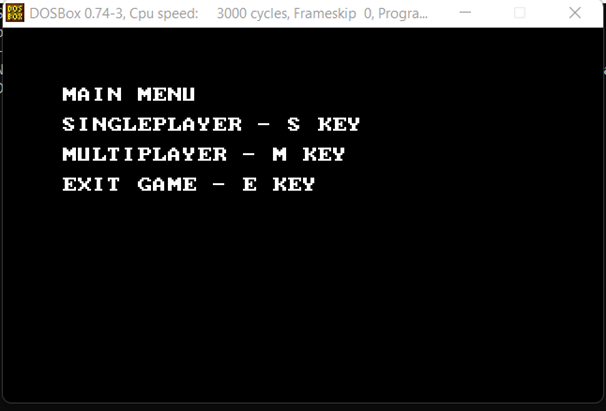
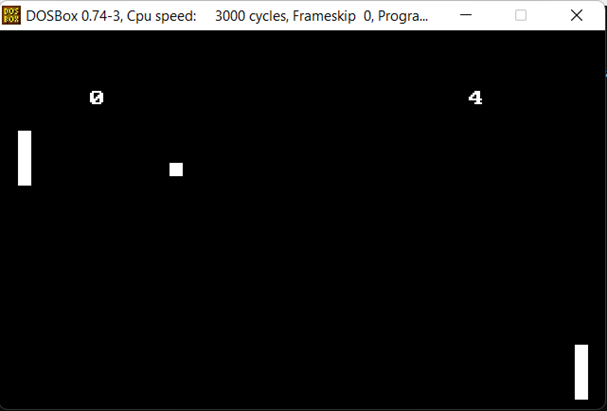
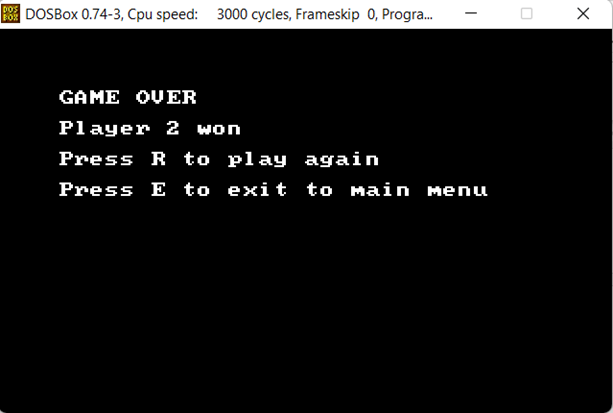

# **Pong Game Program Documentation**

## **1. Name of the Program**
Pong Game in Assembly (8086 Architecture)

## **2. Background of its Computer Architecture**
The Pong game is developed for the **8086 microprocessor architecture**, a 16-bit processor introduced by Intel in 1978. The 8086 processor features:

**•	16-bit data registers:** Supports operations on 16-bit words, with registers like AX, BX, CX, and DX. 
**•	Segmentation Model:** Memory is divided into segments (CODE, DATA, and STACK), each referenced using segment registers like CS, DS, and SS. 
**•	Instruction Set:** Includes operations for arithmetic, logic, data transfer, and control flow, making it suitable for low-level programming. 
**•	Interrupts:** Provides an interrupt mechanism for handling input/output (I/O) and system functions. 

The program takes advantage of the **BIOS interrupt calls (INT 10h and INT 21h)** for graphical and I/O operations, adhering to the DOS environment.

## **3. Description of the Program/Application**

The **Pong Game in Assembly** is a classic two-dimensional table tennis game implemented using 8086 assembly language. The game offers:

**Game Modes**

**1.	Singleplayer Mode:**  
o	The player controls the left paddle using the O (Up) and L (Down) keys. 
o	The right paddle is controlled by a BOT/AI, which dynamically adjusts its position based on the ball's movement. 

**2.	Multiplayer Mode:**  
o	Both paddles are controlled by players: 
	Right paddle: W (Up) and S (Down) keys. 
	Left paddle: O (Up) and L (Down) keys. 

## **Game Mechanics**
•	A **ball** moves across the screen, bouncing off walls and paddles. 
•	The game keeps track of scores for both players. 
•	Players win by scoring 5 points before their opponent. 
•	The main menu allows users to select game modes or exit. 

**UI Components**
**•	Main Menu:** Displays options for Singleplayer, Multiplayer, and Exit. 
**•	Game UI:** Shows the score of each player at the top of the screen. 
**•	Game Over Menu:** Declares the winner and offers options to replay or return to the main menu. 

**Technical Features**
**•	Graphics Mode (INT 10h):** Implements pixel-based graphics for rendering paddles and ball movement. 
**•	Real-Time Key Detection (INT 16h):** Captures player inputs for paddle movements. 
**•	AI Logic:** In Singleplayer mode, the BOT adapts its paddle movement based on the ball's trajectory. 
**•	Interrupt-Based Control:** Utilizes DOS and BIOS interrupts for I/O and graphical operations. 

## **4. How to Use / How It Works**

**Running the Program**
1.	Assemble the code using an 8086-compatible assembler, such as MASM or TASM. 
2.	Link the assembled object file to produce an executable. 
3.	Execute the program in a DOS emulator (e.g., DOSBox) or on a real DOS system. 

**Controls**
**•	Main Menu Navigation:**  
o	Press S or s: Start Singleplayer mode. 
o	Press M or m: Start Multiplayer mode. 
o	Press E or e: Exit the game. 

**•	Gameplay Controls:**
**o	Singleplayer Mode:**  
	Left Paddle: O (Move Up), L (Move Down). 
	Right Paddle: Controlled by BOT. 

**o	Multiplayer Mode:**  
	Left Paddle: O (Move Up), L (Move Down). 
	Right Paddle: W (Move Up), S (Move Down). 

**•	Game Over Menu:**  
o	Press R or r: Replay the game. 
o	Press E or e: Return to the main menu. 

**How It Works**
**1.	Game Initialization:**  
o	Sets up the graphics mode, initializes variables, and displays the main menu. 
**2.	Main Menu:**  
o	Waits for user input to select a mode or exit. 
**3.	Gameplay:**  
o	Continuously updates the ball's position and velocity. 
o	Checks for collisions with walls, paddles, and boundaries. 
o	Updates scores when the ball crosses a boundary. 
**4.	BOT Paddle Movement:**  
o	Predicts the ball's trajectory and adjusts the paddle position in real-time. 
**5.	Game Over:**  
o	Displays the winner and waits for user input to restart or exit. 
**6.	Exit:**  
o	Returns to text mode and terminates the program. 

# **GRAPHICAL USER INTERFACE**

